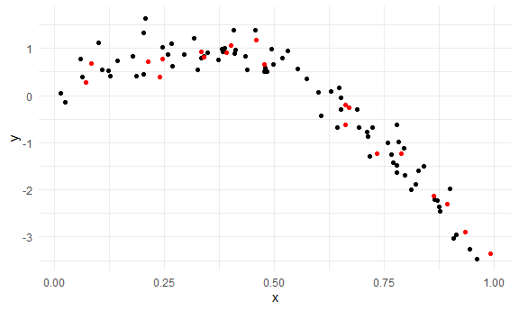
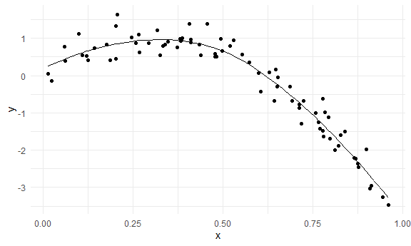
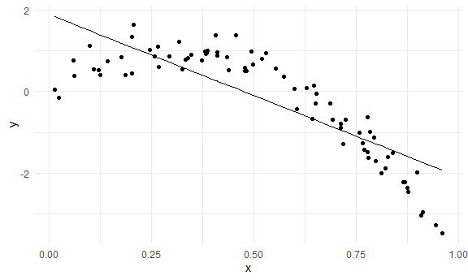

Cross Validation
================

## Simulate a dataset

``` r
set.seed(1)

nonlin_df = 
  tibble(
    id = 1:100,
    x = runif(100, 0, 1),
    y = 1 - 10 * (x - .3) ^ 2 + rnorm(100, 0, .3)
  )

nonlin_df %>% 
  ggplot(aes(x = x, y = y)) + 
  geom_point()
```


Create splits by hand; fit some models.

``` r
train_df = sample_n(nonlin_df, 80) ##80 observations ## 80-20 is common, want enough observations in the training data set so that you can fit the model well, but also want enough data points in the testing data set so the root mean squared error is about right. 

test_df = anti_join(nonlin_df, train_df, by = "id") ## find the people who are not overlapping in the two data sets

ggplot(train_df, aes(x = x, y = y)) + 
  geom_point() +
  geom_point(data = test_df, color = "red")
```



Fit my models:

``` r
linear_mod = lm(y ~ x, data = train_df)
smooth_mod = mgcv::gam(y ~ s(x), data = train_df) ## y is a smooth function of x 
wiggly_mod = mgcv::gam(y ~ s(x, k = 30), sp = 10e-6, data = train_df)
```

Plot the results

``` r
train_df %>% 
  add_predictions(smooth_mod) %>% 
  ggplot(aes(x = x, y = y)) +
  geom_point() + 
  geom_line(aes(y = pred))
```



``` r
## nonlinear model
train_df %>% 
  add_predictions(wiggly_mod) %>% 
  ggplot(aes(x = x, y = y)) +
  geom_point() + 
  geom_line(aes(y = pred))
```


``` r
## linear is not complex enough
train_df %>% 
  add_predictions(linear_mod) %>% 
  ggplot(aes(x = x, y = y)) +
  geom_point() + 
  geom_line(aes(y = pred))
```



quantify the results

``` r
rmse(linear_mod, test_df) ## take linear model, given the coefficient in the linear model, will create predicted value for the testing dataset and subtract those from the observed outcome, take the difference between those and add them up
```

    ## [1] 0.7052956

``` r
rmse(smooth_mod, test_df)
```

    ## [1] 0.2221774

``` r
rmse(wiggly_mod, test_df)
```

    ## [1] 0.289051

-   Iteration process that goes back to the 80-20 and splits and run
    again and repeatedly
